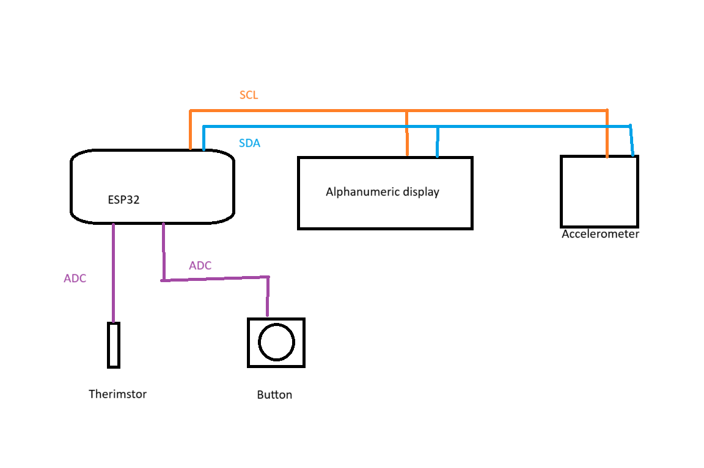
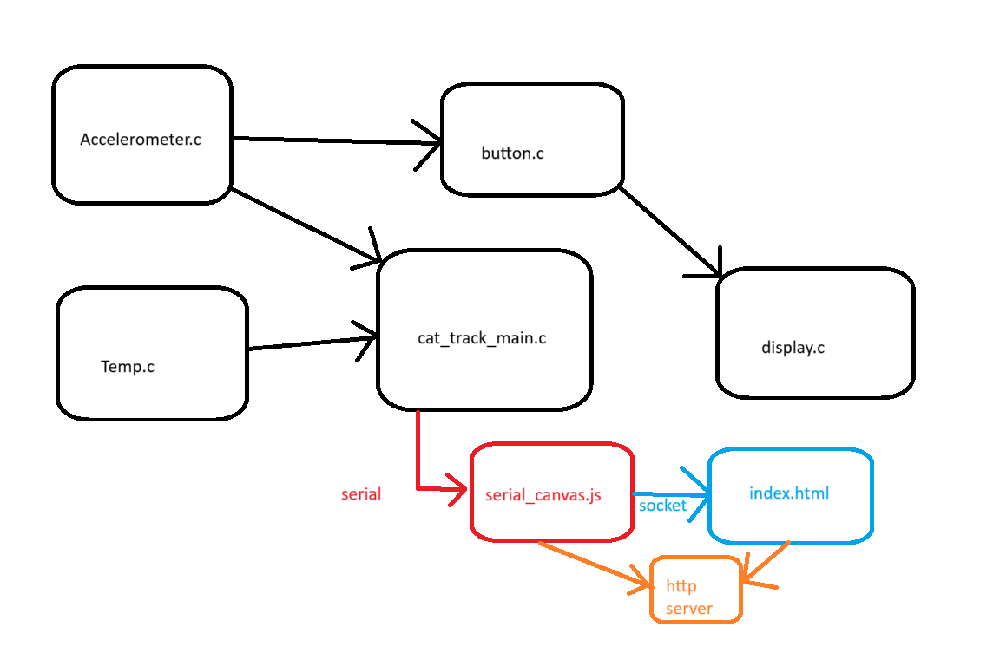
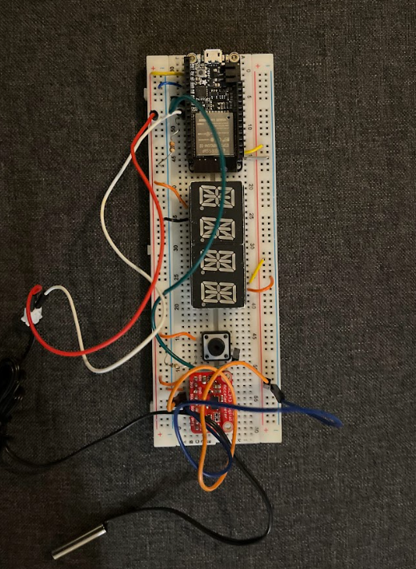

# Quest2: CatTrack

Authors:  Aymeric Blaizot, Sebastian Gilligan, Amado Diallo, Eve Cruanes

Date: 2024-10-04

### Summary

The goal of this quest was to make a device that tracked a cat's activity and temperature and be able to display that
information through an alphanumeric display and a graphical output with canvas js. Activity is measured through an
accelerometer and a user can get the cats name and current activity data from a button push.

### Solution Design

Hardware: alphanumeric display and accelerometer connected to ESP32 via I2C. Button and thermistor connected to ADC 
ports of ESP32.

Software: C code is organized in to multiple files corresponding to components (more detail in code README).

Hardware diagram

Software diagram

Circuit Picture

### Quest Summary
We were successful in reading, interpreting, and displaying the data collected from the sensors. On the hardware side,
thing were relatively easy with the two most complicated componets (display and accelerometer) were connected over I2C
which only needs two wires. One challenge was organzing the code in to seperate C files with header files, and going forward
we will do this when doing our skills so we can easily combine components together. The accelerometer was also a challenge as we had to write the I2C write and read registers functions to extract data. A single missing or misplaced command would make the transaction fail with no feedback as to what needs to change.

 The other large challenge was getting the JS to work. The example code given to us had a couple missing lines with reading from the serial port. Also, when first trying to produce the graph with the values being passed through the socket, the graph was blank. Parsing and making sure that the values were being graphed was difficult as well as setting the marker color and legend for the type of acitivty being presented.  

### Supporting Artifacts
- [Link to video technical presentation](https://drive.google.com/file/d/1ONn7RTq1PrA78Xwzjg-EZ1dZ2OFQRsEe/view?usp=sharing). Not to exceed 120s
- [Link to video demo](https://drive.google.com/file/d/16MaCjKz44M4cqcceWfa96l1EMOn6ckRZ/view?usp=drive_link). Not to exceed 120s

### Self-Assessment 

| Objective Criterion | Rating | Max Value  | 
|---------------------------------------------|:-----------:|:---------:|
| Corectly keeps track of time | 1 |  1     | 
| Measures acceleration | 1 |  1     | |
| Provides reasonable classification of acceleration | 1 |  1     | |
| Provides continuous reporting of time, temperature, and activity to laptop | 1 |  1     | 
| Alphanumeric display triggered by button press | 1 |  1     | 
| Alphanumeric display shows cat name and current activity and time in activity | 1 |  1     | 
| Data at laptop plotted as stripcharts | 1  |  1     | 

### AI and Open Source Code Assertions

- We have documented in our code readme.md and in our code any software that we have adopted from elsewhere
- We used AI for coding and this is documented in our code as indicated by comments "AI generated" 

