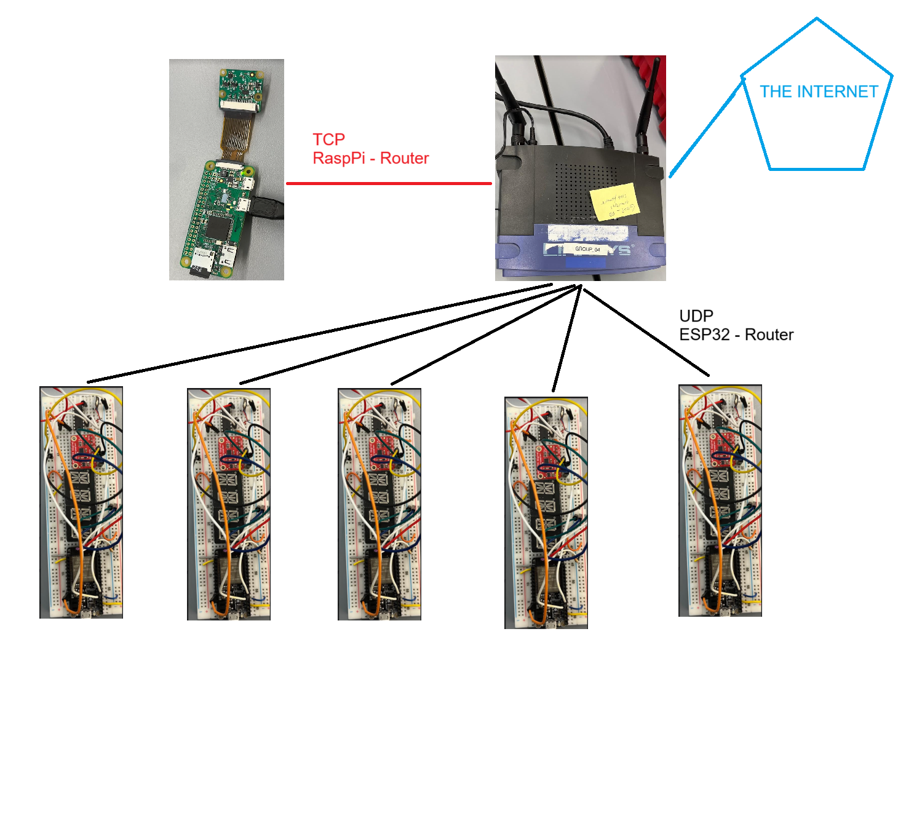
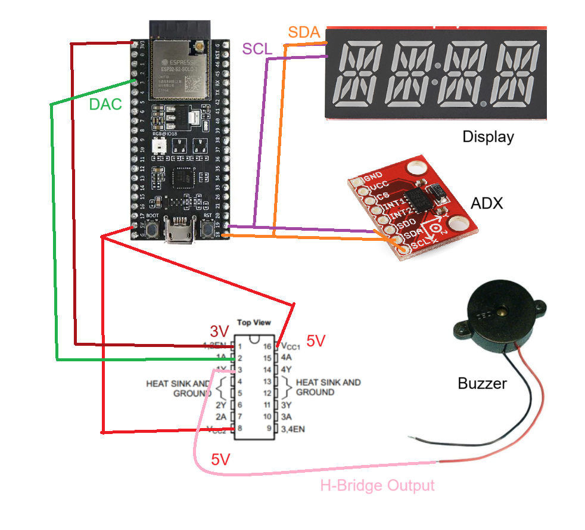
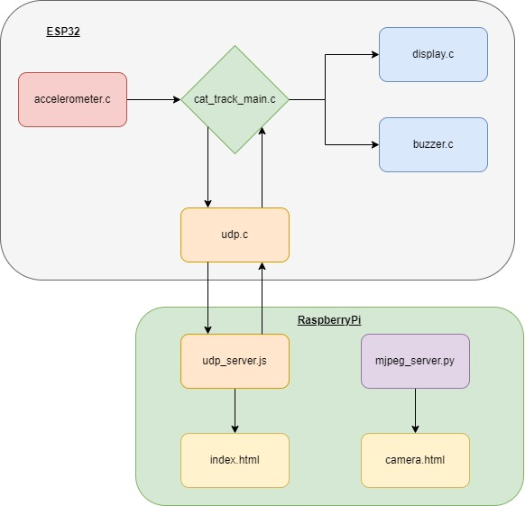

# FitCat

Authors: Aymeric Blaizot, Eve Cruanes, Amado Diallo, Sebastian Gilligan

Date: 2024-10-25

### Summary

FitCat is a network of ESP32 devices that are connected via WiFi to a central RaspberryPi server. The ESP32s track the activity of the cats with an accelerometer and displays their rank among the other cats on an alphanumeric display. It also gives the most active cat a gentle little buzz every 10 minutes to let the cats know that a leader has changed. The RaspberryPi also has a camera to monitor the cats. The ranking of all the cats and the live camera feed can be viewed via a website.

### Solution Design

Our solution can be broken down in to 2 main parts, the ESP32 devices (clients) and the RaspberryPi Server. The hardware on the ESP32 is an accelerometer for sensing activity, an alphanumeric display to display cat rank, and the buzzer hooked up via an H-bridge. The ESP32 is running mulithreaded C code (code explained in Code README) and reveiving UDP packets from the router. The hardware on the RaspberryPi is a PiCamera. The Raspberry Pi is simotaneously running a Node JS server to determine ranking, running Canvas JS, sending TCP packets to the router, and running a Python script to send the live camera feed to the Router.  

Network Diagram

ESP32 Wiring Diagram

Software Diagram

### Quest Summary
Challenges:
1. Understanding how an H-Bridge works and wiring it to the ESP32.
2. Understanding how to use the DAC ESP32 API.
3. Connecting the RaspberryPi to Wifi (making sure SSID was correct).
4. Finding a way to stream PiCamera to HTML.
5. We had trouble building the ESP32 code on everyone's computer, but we were able to flash using one computer.
6. We could not do much work asynchrounously as we need to be together with the router.

### Supporting Artifacts
- [Link to video technical presentation](https://drive.google.com/file/d/1igx9XaUDCPDiB7xMHA416dLeWjjycv91/view?usp=sharing). Not to exceed 120s
- [Link to video demo](https://drive.google.com/file/d/1EW2HpIJcmVa_-JCr5nPhsvrF9ybI6xGt/view?usp=sharing). Not to exceed 120s

### Self-Assessment 

| Objective Criterion | Rating | Max Value  | 
|---------------------------------------------|:-----------:|:---------:|
| Cat Trackers connected via WiFi | 1 |  1     | 
| Data from each (5) Cat Tracker sent to central server and aggregated | 1 |  1     | 
| Portal reports live leader status for each activity state for each cat and charts them on web site | 1 |  1     | 
| Central server reports live leader status back to Cat Tracker alpha displays and buzzer | 1 |  1     | 
| Portal accessible from open internet | 1 |  1     | 
| Web cam operational at the same client | 1 |  1     | 
| Node.js runs on pi | 1 |  1     | 

### AI and Open Source Code Assertions

- We have documented in our code readme.md and in our code any software that we have adopted from elsewhere
- We used AI for coding and this is documented in our code as indicated by comments "AI generated" 

