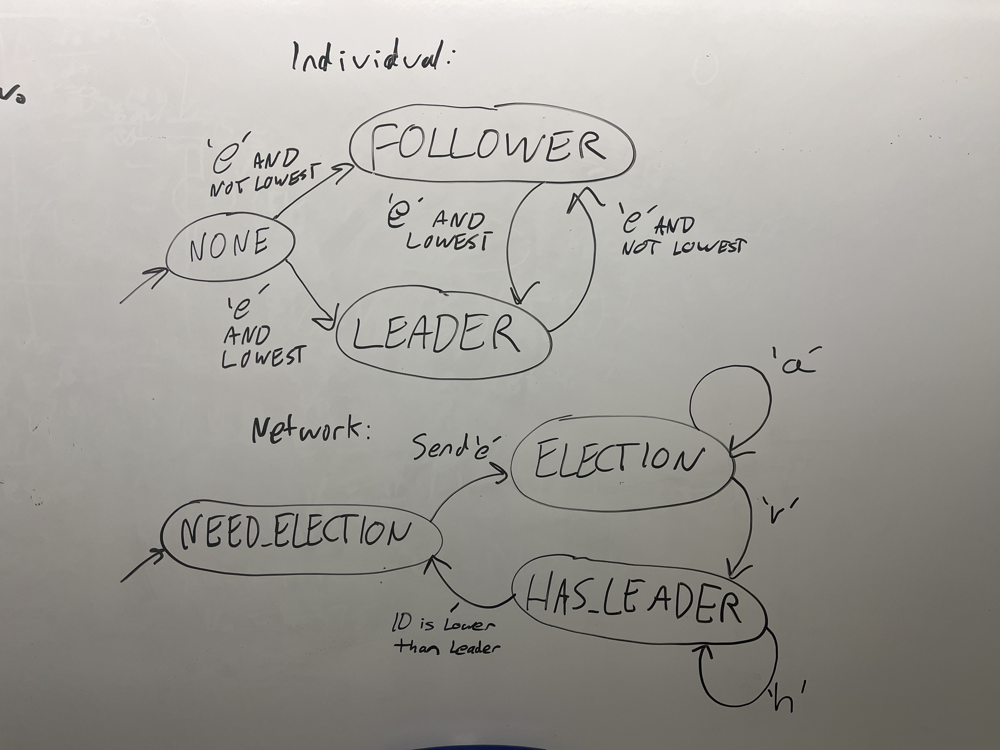

# Secure E-Voting

Authors: Eve Cruanes, Sebastian Gillian, Aymeric Blaizot, Amado Diallo

Date: 2024-11-09

### Summary

The purpose of this project is to create a system of voters (ESPs) that can vote within a group that contains a leader. This leader is based on highest ID. The followers then chose to vote and send their votes to the leader which then sends the votes to the server. The raspberry pi is hosting a server which is sending the voting data to the database, updating it, as well as querying the whole database and displaying it on a web interface for the user to look at, clear it or update it. 

### Solution Design

The main parts of the solution is electing a leader, communication between voters and displaying/storing data. 

ELECTING A LEADER : 
  On start up, the fobs go through an election process, selecting the device with the lowest IP address as the leader. The devices do this by taking the minimum of the IP addresses that acknowledged the election call or called the election. The leader sends heartbeats to all other devices. If the leader disconnects, another device will call for an election after missing a certain number of heartbeats.
Once connected to the network, a fob call for all  its IP address to all other fobs on the network, 

COMMUNICATION THROUGH VOTERS: 
  The new voters communicate their votes via an IR sensor. When a new node is added to the group of voters, it sends a payload containing what party it votes for. This is used via a VOTEPIN. When the button is pressed, the ESP sends its vote to another voter. This voter then sends the vote to it's leader because the leader is known across all voters. 

SERVER, DATABASE AND WEB INTERFACE: 
  The front end of the project involves a node server hosted on the raspberry pi. This server listens for new information being sent using udp messaging. When new information is sent, the node server updates the database with a new entry. The server also listens for a socket update or reset from the web interface. If the button for update or reset is pushed via the web interface, the database is reset in the back and front end or updated based on the current database. The web interface has 2 buttons, update and reset and the table displaying the current database. 

Software Diagram

General Voting Flow

Election Flow 

Voter Circuit

Finite State Machines

### Quest Summary

In summary, the E-Voting system allows for voters (ESPs) to vote through IR, the leader of this group then can send this to a server as well as provide confirmation back to the original voter. The server stores the votes in a database as well as displaying the current database in an html table. The LEDs allow for the current state of the ESP to be displayed either as follower,leader or election. Overall, our results were good as we completed all requirements. 

CHALLENGES : 
Some of the challenges we faced throughout this project was the udp.c file, the leader election skill and working synchronously. The udp.c file was a big challenge because it is one of our longest files and very hard to read. There are multiple events in this quest where messages are being sent based on states and this can become confusing. Another challenge was the leader election, queues were difficult to understand especially when we never realized that a lot of the queue code was always given to us. Furthermore, the edge cases like if leader receives a heartbeat from another leader or if a lower IP address joins the network. Lastly, a challenge that continues to occur is the router and working synchronously. We can't really work on the project without all of us connecting to the router and are together. One more challenge was needing to clear the database every time. 

### Potiental Security Vulnerabilites
Scenario 1 - Corrupt Leader: A hacker programs their ESP to hold an IP address that grant them the lowest ID (i.e. 192.168.1.001) allowing them to automatically hold leader status upon connecting to the ESP32 network. From here, the hacker can either send garbage data to the server or falsified votes.

Solution: On the server side, blacklist any IP addresses that send data that isn't properly formatted. In the case of falsified votes, establish a global data structure that each device can access (except for the leader) that holds each vote. If a device receives a leader confirmation that does not match the latest vote in this data structure, send a warning signal to potentially decide a new leader or ignore the corrupt leader entirely.

Scenario 2 - Corrupt Leader Stalling: Similarly to scenario 1, an intruder sets their IP such that they become leadder in the network of ESP32s. In this case, the corrupt leader periodically cuts its communication with the other devices forcing spontaneous leader elections that drastically stalls performance and server-client communication.

Solution: To detect malicious election stalling, we would need to calculate the rate of missed heartbeats under a leader to ensure that leader deaths are not frequent. If this "missed heartrate" exceeds a certain value, the devices choose a new leader and ignore the frequently rebooting device. This solution isn't perfect and could falsely identify a faulty device as a corrupt leader, but it helps to ensure this attack is more difficult to enact.

Scenario 3 - A hacker intercepts the information being transferred from the leader to the Raspberry Pi server (perhaps by spoofing the IP address to match the Raspberry Pi or by using ARP spoofing) and is now able to store or modify private voter information.

Solution: Use the ESP-IDF's built-in Secure Socket Layer support which encrypts communication over IP addresses. This would ensure that the voter information received by an intruder would be unreadable and unmodifiable. This would also work just as well to protect any UDP communications that occur between ESP32 devices.

### Supporting Artifacts
- [Link to video technical presentation](https://drive.google.com/file/d/1TODrl5D42cvak3dfih5pf6blyz43ZLlU/view?usp=sharing). Not to exceed 120s
- [Link to video demo](https://drive.google.com/file/d/1CpnuTLTcsLeOWrVnICbChWvUPVNr4COA/view?usp=sharing). Not to exceed 120s

### Self-Assessment 

| Objective Criterion | Rating | Max Value  | 
|---------------------------------------------|:-----------:|:---------:|
| Objective One | 1 |  1     | 
| Objective Two | 1 |  1     | 
| Objective Three | 1 |  1     | 
| Objective Four | 1 |  1     | 
| Objective Five | 1 |  1     | 
| Objective Six | 1 |  1     | 
| Objective Seven | 1 |  1     | 
| Objective Eight | 1 |  1     | 
| Objective Nine | 1 |  1     | 
| Objective Ten | 1 |  1     | 

### AI and Open Source Code Assertions

- We have documented in our code readme.md and in our code any software that we have adopted from elsewhere
- We used AI for coding and this is documented in our code as indicated by comments "AI generated" 

