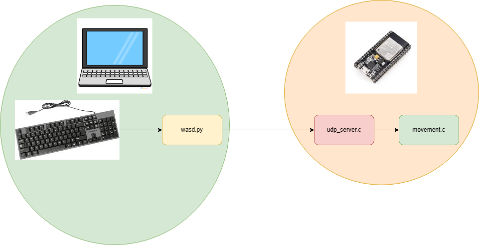

# Personal Indoor Robot Assistant

Authors: Eve Cruanes, Sebastian Gillian, Aymeric Blaizot, Amado Diallo

Date: 2024-12-06

### Summary

The purpose of the quest is to have a pair of rovers to follow a set of waypoints and avoid collisions. The rovers are controlled by ESP32s attached to TT motors and obtain their position from a Node.js server attached to an Optitrack system. The rovers also have a remote control option where a user can drive the rover in specific directions through keyboard (WASD) input. In order to ensure the rovers follow the waypoint accurately, we use feedback from the Optitrack server to correct the rovers. The pathing of the rovers creates a potiental collision, so both of them are equipped with a sharp infrared range sensor to detect each other. Once they are in view of each other, one of the rovers will move backwards to allow the other to proceed before proceeding itself. 

### Solution Design

Our solution design can be split into 5 parts: movement for the rovers including cardinal directions and rotations, movement along the waypoint path, feedback control for the rovers to stay on the waypoint path, collision detection and behavior for the rovers, and optional remote control via keyboard input.

MOVEMENT: First, we analyze the hardware of the rovers. Each rover is built as a set of TT motors attached to a frame with an ESP32 connected via a breadboard. We use L293D H-Bridge to interface the ESP32 with the motors. Attached to the H-Bridge are 4 GPIO pins (2 for each motor) and 2 motor pins for each motor. This allows us to control the direction of the rover as we can set the GPIO pins to drive a forward or backwards movement. In order to control the speed of the car, we also attach PWM pins to the enable pins of the H-bridge to attune the speed of the rovers based on the duty cycle of the signal. In order for the rover to turn left or right, we simply set the duty cycle of the opposite motor to 0. We set the convention that the "normal" rover speed is a duty cycle of 512. 

WAYPOINT MOVEMENT: We now contend with having the rovers move across a defined set of waypoints. Above the path are a series of Optitrack cameras attached to a Node.js server which can relay the position of our rover to its corresponding ESP32. We create a UDP client on our ESP32 to send our rover ID to the Optitrack server so it can return the rover's position (coordinates and orientation) to the ESP32. From there, we can use the coordinates to determine what direction the rover should go (either forwards or rotate).

PATH CONTROL: Because of the nature of the motors (and mechanical hardware in general), following the path accurately isn't as simple as configuring a forwards movement as the rover will inevitably stray from the line of movement. Thus, we use the position and angle data we receive from the Optitrack server to recorrect the rover's pathing. Originally, our team used a naive algorithm where depending the rover's offset to the path, the rover would turn slightly in the opposing direction. However, this did not work well, so we switched to a PID-based implementation where the error changes based on the rate of change of error (derivative) and the total error (integral). The error in this case is the angle deviation (theta) from the desired path. Because we are considering the angle of the rover, we can use simple trigonometric calculations to calculate the desired angle needed to get back on track. We plug this angle into our PID algorithm as our setpoint (desired value) and the rover will orient itself to the angle it needs to stay on path. These calculations happen very frequently as the rover traverses the course.

COLLISION: Because we have two rovers running on the same track, we need a way for the rovers to detect collisions along the waypoint path. We utilize a sharp infrared range sensor attached to the front of the rover. We use an ADC input for the sensor and use the same ADC1 code we used in prior quests with the exception of converting the raw ADC values to a distance in cm rather than another parameter. Upon two rovers noticing each other, both rovers will halt their movements for a certain period of time, and one rover will begin moving before the other. We use the rover's ID which is exclusive to each rover to determine the period of time to stop upon object detection. 

REMOTE CONTROL: In order to establish wireless control of the rover, we utilize a UDP connection between the ESP32 and an external laptop. The ESP32 holds the role of a server that listens for a keyboard input from the client which is the external laptop. We implemented a quick function on the ESP32 side that takes in a character and converts it to a direction to move or rotate. We host a Python client on the laptop that sends a keyboard input to the server. The ESP32 listens for this keyboard input and plugs it in to the aforementioned function. We have traditional WASD control for the rover, and when the user presses 'Q' which closes the remote control and returns the rover to an autonomously driven state. The rover can also quickly switch between autonomous movement and manual movement at the press of a keyboard input from the user.

STREAMLIT: To display the path of the two cars, hosted a node server that pings the server for X and Z coordinates of both cars along with their IDs. The streamlit python code requests this information and the server queries from the database and sends it. Streamlit is then hosted and receives this query which graphs the coordinates of the 2 paths of the cars as well as the 4 checkpoints of the map in red. 

Code Flow

Remote Control

### Quest Summary
In summary, we've successfully configured two rovers to autonomously move across a track concurrently with the help of an Optitrack camera system to receive the position of the rovers. The rovers' movement can accurately be controlled by setting GPIO pins and the duty cycle of PWM signals. These rovers will automatically correct themselves if they deviate from the track using PID and trigonometry  and will halt its movement upon detecting that an object is in front of it. The rovers can also optionally be controlled with keyboard inputs and can switch between autonomous and manual movement.

CHALLENGES: A large part of our challenges in this project was with getting the rover to follow the path accurately. All of the calculations we did were a bit tedious and required a lot of trial-and-error. The Optitrack server was also a source of issues for us. Since it was a singular setup used by the entire class, there were a few times where the server needed maintenance which cost us some time. We also had to contend with working around all of the other groups as there was only one track. We also had issues with our proximity sensor being janky or always detecting objects.

### Supporting Artifacts
- [Link to video technical presentation](). Not to exceed 120s
- [Link to video demo](). Not to exceed 120s

### Self-Assessment 

| Objective Criterion | Rating | Max Value  | 
|---------------------------------------------|:-----------:|:---------:|
| Objective One |  |  1     | 
| Objective Two |  |  1     | 
| Objective Three |  |  1     | 
| Objective Four |  |  1     | 
| Objective Five |  |  1     | 
| Objective Six |  |  1     | 
| Objective Seven |  |  1     | 

### AI and Open Source Code Assertions

- We have documented in our code readme.md and in our code any software that we have adopted from elsewhere
- We used AI for coding and this is documented in our code as indicated by comments "AI generated" 

