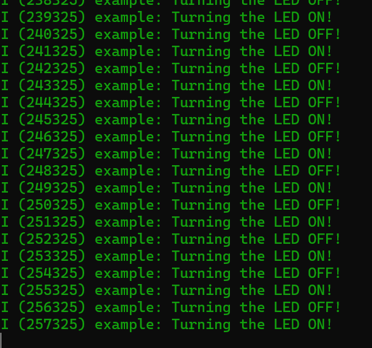

#  Setup Editors and IDEs

Author: Sebastian Gilligan

Date: 2024-09-05

### Summary

Installed ESP-IDF for VSCode and ran blink on ESP32

### Evidence of Completion
- Attach a photo or upload a video that captures a demonstration of
  your solution. Include in the photo/video your BU ID.

Template for Including Graphics

### AI and Open Source Code Assertions

