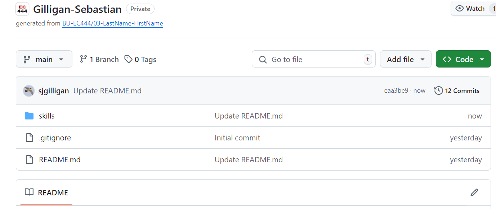

#  Set up and Use GitHub Individually

Author: Sebastian Gilligan

Date: 2024-9-6

### Summary

Cloned repo and renamed

### Evidence of Completion
- Attach a photo or upload a video that captures a demonstration of
  your solution. Include in the photo/video your BU ID.

Template for Including Graphics

Or

- [Link to video demo](). Not to exceed 10s

### AI and Open Source Code Assertions

