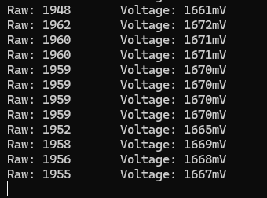
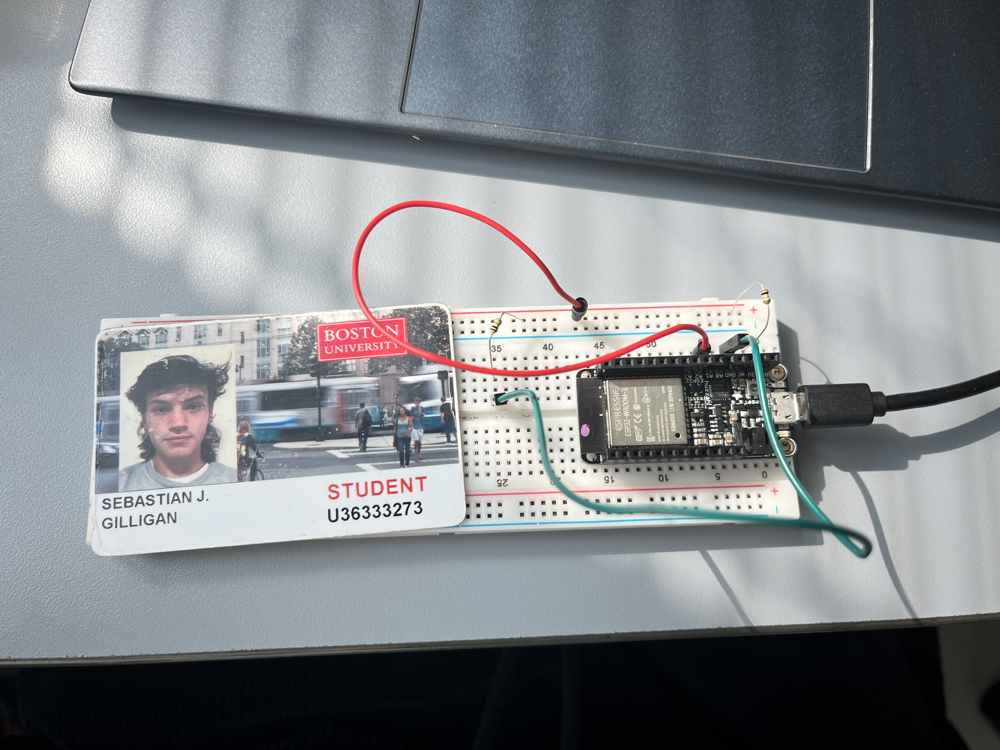

#  Battery Voltage Monitor

Author: Sebastian Gilligan

Date: 2024-09-12

### Summary

First I wired up the voltage divider, using R1=R2 to divide the voltage in half from 3.3V to around 1.6V. The output voltage goes to GPIO34. The code is based off the example given but sets up the ADC (attentuation increased), a continous while loop with a for loop that records 10 readings every 100ms and then displays the average of those 10 readings every second.

### Evidence of Completion
- Attach a photo or upload a video that captures a demonstration of
  your solution. Include in the photo/video your BU ID.

Template for Including Graphics

Or

Template for Including Graphics

### AI and Open Source Code Assertions

- I have documented in my code readme.md and in my code any
software that we have adopted from elsewhere

