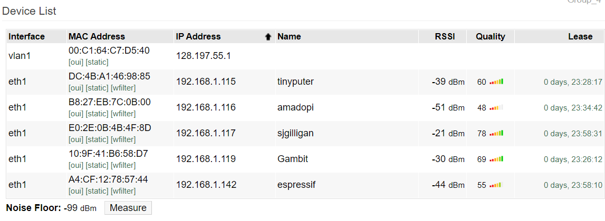
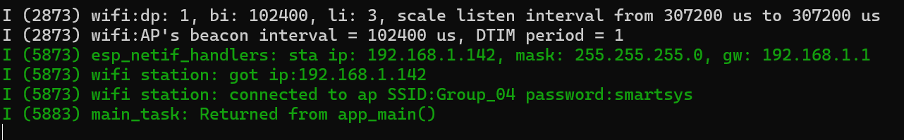

#  ESP 32 Wifi Station

Author: Sebastian Gilligan

Date: 2024-10-20

### Summary

Ran the wifi station code on the ESP32, verrifed it was connected to the router.

### Evidence of Completion
- Attach a photo or upload a video that captures a demonstration of
  your solution. Include in the photo/video your BU ID.

ESP32 on router

ESP32 Showing IP

