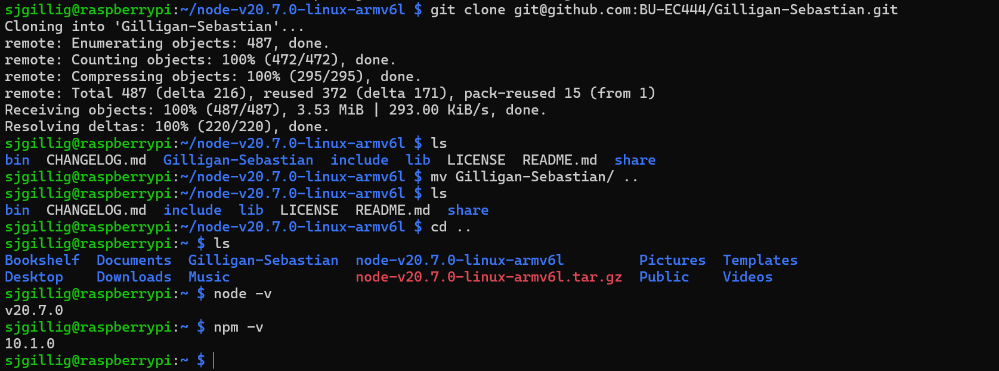

#  Raspberry Pi

Author: Sebastian Gilligan

Date: 2024-10-11

### Summary

Flash PI to connect to router, SSHed to the PI, cloned git repo on PI, installed node JS

### Evidence of Completion

Evidence

