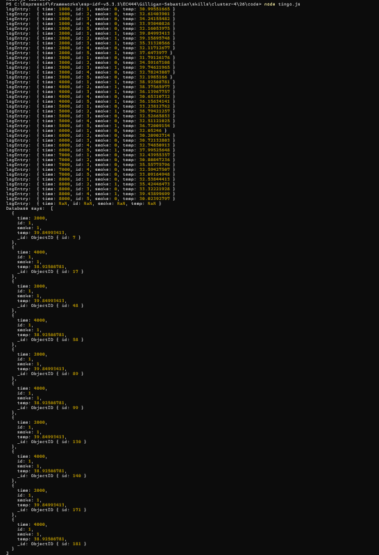

#  Persistence with tingoDB Database

Author: Sebastian Gilligan

Date: 2024-11-11

### Summary

Using code provided and looking online, just read in smoke data from file, write to DB, and querry the DB.

### Evidence of Completion

tingo.js output

