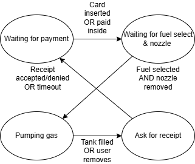

#  State Models

Author: Sebastian Gilligan

Date: 2024-11-17

### Summary

Created a state model of a gas pump, created an FSM diagram, a state table, coded it in C using ChatGPT. Usually don't use LLMs for programming but when I've already done all the thinking it is nice to have it type for me.

### Evidence of Completion
- Attach a photo or upload a video that captures a demonstration of
  your solution. Include in the photo/video your BU ID.

FSM

This can also be represented with the table:

| Event/State | Waiting for payment | Waiting for fuel select & nozzle  | Pumping gas | Ask for receipt
|---|---|---|---|---|
|Card inserted OR paid inside|Waiting for fuel select & nozzle|N/A|N/A|N/A|
|Fuel selected AND nozzle removed|N/A|Pumping gas|N/A|N/A|
|Tank filled OR user removes|N/A|N/A|Ask for receipt|N/A|
|Receipt accepted/denied OR timeout|N/A|N/A|N/A|Waiting for payment|

