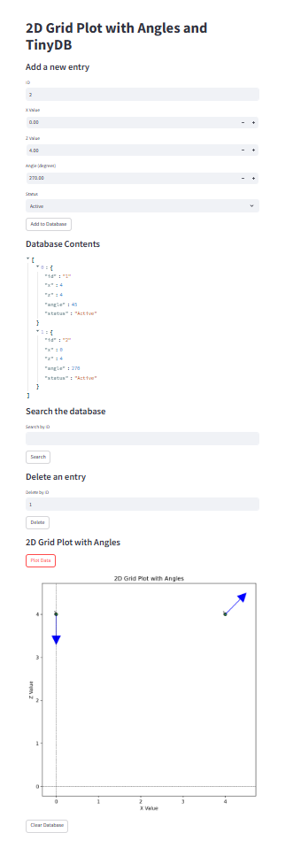

#  Streamlit

Author: Sebastian Gilligan

Date: 2024-11-30

### Summary

Created a python program that creates a database with TinyDB, then creates a Streamlit app with functions to add entries in to the DB. I made the entries {ID, x, z, theta, status} to use in the quest later. It then uses matplotlib to plot points on a graph and an arrow pointing at the angle set in theta. I used ChatGPT to learn how to use the python libraries.

### Evidence of Completion

Streamlit app connected to TinyDB.

